# Part 1. Install and configure ParallelCluster

## 1.
Use pip to install the AWS ParallelCluster software:

```shell
(aws) $ pip install aws-parallelcluster --upgrade --user
```

## 2.
You will also need to install nvm, a version manager for Node.js [here](https://github.com/nvm-sh/nvm), as it is used by AWS ParallelCluster CLI.

Scroll to the section on **Installing and Updating** to install nvm. You might need to reload the `.bashrc` (or equivalent file if you are not using the bash shell) file after installation by doing:

```shell
(aws) $ source ~/.bashrc
```

Once you are done, you can do the following to check that nvm is installed properly:
```shell
(aws) $ nvm --version

0.39.5
```

You can now use nvm to install Node.js:
```shell
(aws) $ nvm install node
```

You can do the following to make sure it is installed properly:
```shell
(aws) $ node --version

v18.18.0
```

## 3.
Edit your shell’s config file (e.g. `~/.bash_profile`, `~/.zshrc`, `~/.bashrc`) using the nano editor:

```shell
(aws) $ nano ~/.bash_profile
```

to add pcluster’s directory `~/.local/bin` to your shell’s `$PATH` variable by adding the following line at the end of the file (replace the highlighted portions of the path with those appropriate for your home directory):
```bash
export PATH="/Users/shihcheng/.local/bin:$PATH"
```

Save and exit the nano editor by typing `Ctrl-x`, followed by `y` to save the file, and `Return` to use the same filename.

## 4.
Reload your shell’s config file (replace with `.zshrc` or `.bashrc` as necessary):

```shell
(aws) $ source ~/.bash_profile
```

or:
```shell
(aws) $ . ~/.bash_profile
```

This will reset your conda environment, so you should reactivate your aws environment:

```shell
(base) $ conda activate aws
```

## 5.
Check that you can run pcluster, and get the version number returned:

```shell
(aws) $ pcluster version

{
  "version": "3.7.0"
}
```

## 6.
You will now create a configuration file for pcluster in your home directory:

```shell
(aws) $ pcluster configure --config ~/cluster-config.yaml
```

Select these answers to the prompts: 

```yaml
AWS Region ID: ap-southeast-1
EC2 Key Pair Name: MyKeyPair
Scheduler: slurm
Operating System: alinux2
Head node instance type: t2.micro
Number of queues: 1
Name of queue 1: queue1
Number of compute resources for queue1: 1
Compute instance type for compute resource 1 in queue1: t2.micro
Maximum instance count: 10
Automate VPC creation? (y/n): y
Availability Zone: ap-southeast-1a
Network Configuration: Head node and compute fleet in the same public subnet
```

Wait until the program completes the setup.

## 7.
Edit the configuration file created by the command above:

```shell
(aws) $ nano ~/cluster-config.yaml
```

## 8.
In the `HeadNode` section, find the entry for `InstanceType`:
```yml
HeadNode:
  InstanceType: t2.micro
```


## 9.
In order to avoid running out of one particular type of instance, insert the instance type from the table below according to the last number before the letter in your student number (e.g. use the number `4` if your student number is `A0171234X`):

| Number | Instance Type | Number | Instance Type | Number | Instance Type |
| ------ | ------------- | ------ | ------------- | ------ | ------------- |
| 0      | t3a.nano      | 4      | t3.micro      | 8      | t3.medium     |
| 1      | t3.nano       | 5      | t3a.small     | 9      | c5a.large     |
| 2      | t2.nano       | 6      | t3.small      |        |               |
| 3      | t3a.micro     | 7      | t3a.medium    |        |               |

## 10.
Do the same for `Name` and `InstanceType` in the `Scheduling` section:
```yml
Scheduling:
  Scheduler: slurm
  SlurmQueues:
  - Name: queue1
    ComputeResources:
    - Name: t2-micro
      InstanceType: t2.micro
```

> <p class="warn"> Warning
>
> The `Name` field can only take letters, digits, and hyphens, so replace the period in the instance type with a hyphen when entering it into the `Name` field, e.g. `t3a-nano` instead of `t3a.nano`.


## 11.
Add the following after the `Scheduling` section (use copy and paste to avoid typos):
```yml
SharedStorage:
  - MountDir: data
    Name: ee3801
    StorageType: Ebs
    EbsSettings:
      Size: 1000
      Encrypted: false
      SnapshotId: 
```

Leave the `SnapshotId` field empty for now. You will enter this information later after you have created a copy of the snapshot we have created for you. This will give you access to the data you will be processing for the remaining labs, which is stored as a Elastic Block Storage snapshot on AWS. The `MountDir` setting means that the files and directories in the snapshot can be found in the `/data` directory on your cluster.

## 12.
Check your config file by doing:
```shell
(aws) $ cat ~/cluster-config.yaml
```

which should look like the following (except the instance type should follow the instructions from above):

```yml
Region: ap-southeast-1
Image:
  Os: alinux2
HeadNode:
  InstanceType: t3a.nano
  Networking:
    SubnetId: subnet-xxxxxxxxxxxxxxxxx
  Ssh:
    KeyName: MyKeyPair
Scheduling:
  Scheduler: slurm
  SlurmQueues:
  - Name: queue1
    ComputeResources:
    - Name: t3a-nano
      InstanceType: t3a.nano
      MinCount: 0
      MaxCount: 10
    Networking:
      SubnetIds:
      - subnet-xxxxxxxxxxxxxxxxx
SharedStorage:
  - MountDir: data
    Name: ee3801
    StorageType: Ebs
    EbsSettings:
      Size: 1000
      Encrypted: false
      SnapshotId:
```

Check carefully for typos as they will cause problems in the subsequent steps.

## 13.
Before we create a cluster, which might take 10 minutes or more depending on how busy AWS is, we will use the Simple Notification System on AWS to notify you when the cluster is ready:

```shell
(aws) $ aws sns create-topic --name awsnotify
```

which should return something like the following (with a different AWS ID number):
```shell
{
    "TopicArn": "arn:aws:sns:ap-southeast-1:123456789012:awsnotify"
}
```

Copy the `TopicArn` number (highlighted in yellow) created for you so you can use it in the subsequent commands.

Subscribe to the topic by using the following command (which should be entered in one line with no line breaks, paste the `TopicArn` number above into the command below, and change the email address `abcde@nus.edu.sg` to your email address):

```shell
(aws) $ aws sns subscribe --topic-arn arn:aws:sns:ap-southeast-1:123456789012:awsnotify --protocol email --notification-endpoint abcde@nus.edu.sg

{
    "SubscriptionArn": "pending confirmation"
}
```

You should then receive a subscription confirmation email with a link that you can click to confirm your subscription.

You can then send a test message by doing (replace the `TopicArn` number):
```shell
(aws) $ aws sns publish --topic-arn arn:aws:sns:ap-southeast-1:123456789012:awsnotify --message "test"

{
    "MessageId": "2fb0a38d-2aeb-5336-a517-fa374b3c7ce4"
}
```

Check your email to see that you received the test message successfully to verify that the notification system has been set up properly.

We can create a shell function to make it easier to send notifications by adding the following to the end of your shell config file (e.g. `~/.bash_profile`, `~/.bashrc`, `~/.zshrc`, etc.):
```bash
awsnotify() {
	aws sns publish --topic-arn arn:aws:sns:ap-southeast-1:123456789012:awsnotify --message "$1"
}
```

Reload the configuration file by doing:

```shell
(aws) $ source ~/.bash_profile

(base) $ conda activate aws
```

and test it by doing:
```shell
(aws) $ awsnotify test2 
```

If you receive an email with the message `test2` after a few minutes, it means you have successfully created a shell function to make sending AWS notifications easier.

## 14.
We will now use the EventBridge service in AWS to notify you once your cluster is set up, so login to your AWS [console](https://console.aws.amazon.com).

Type `Amazon EventBridge` into the search bar at the top, and click on `Amazon EventBridge` in the drop-down list:
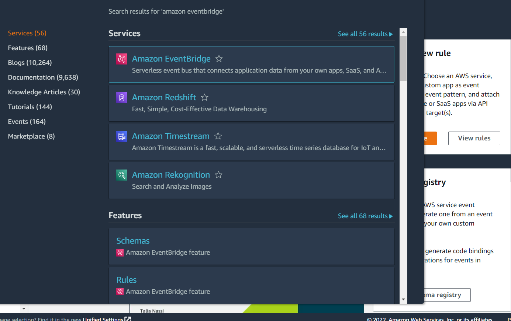

Click on `Rules` in the panel on the left:
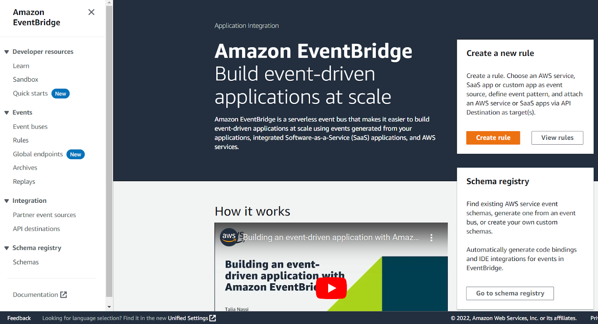

Click on the `Create rule` button:
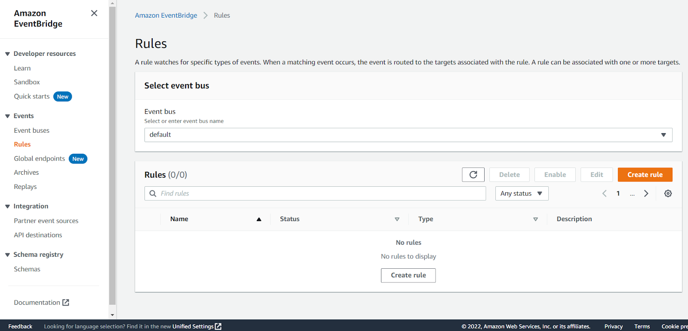

Enter something like `EC2Running` in the Name field and click `Next`:
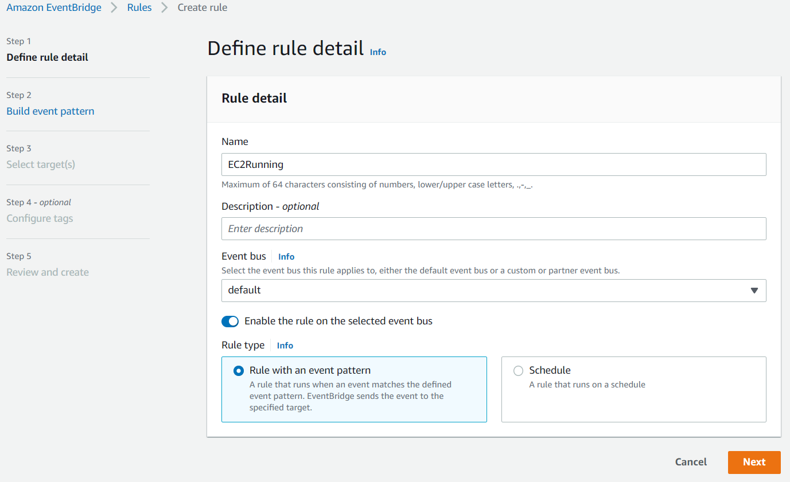

Scroll down to the `Event pattern` section. Under the `AWS service` section, select `EC2` from the drop-down list, `EC2 Instance State-change Notification` from the `Event Type` drop-down list, select the `Specific state(s)` option, and select `running` from the drop-down list, and click `Next`:
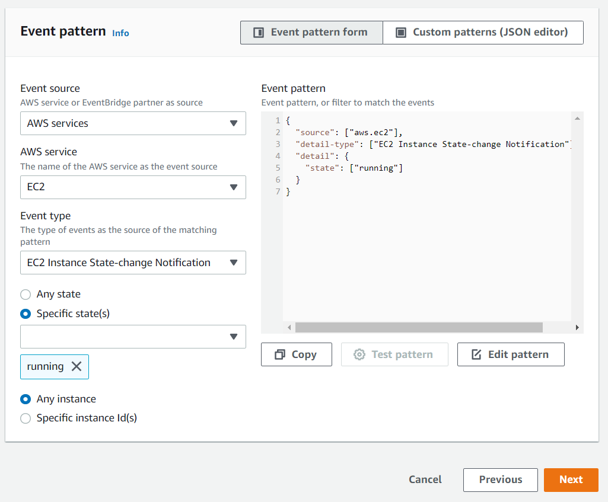

Under the `Target` section, select `SNS topic` from the first drop-down list and `awsnotify` from the `Topic` drop-down list, then click `Next`:
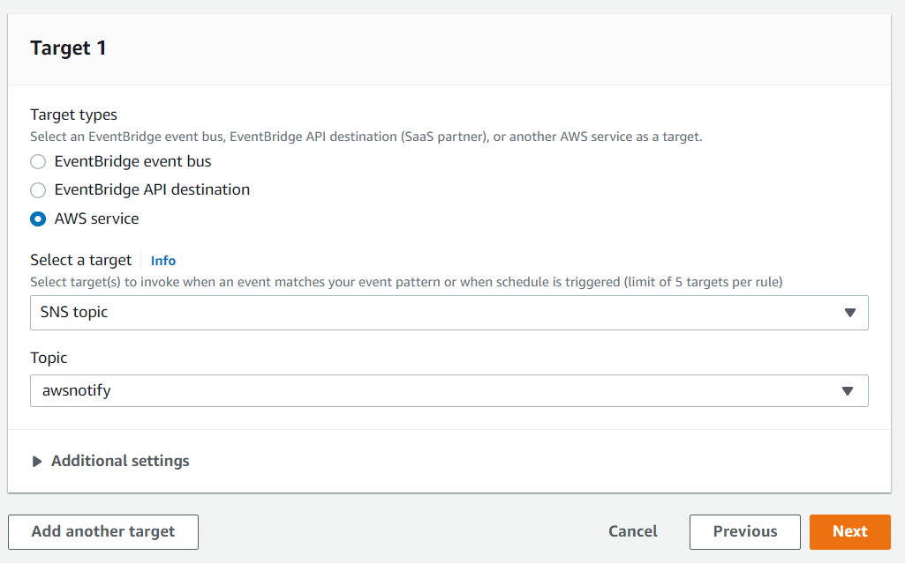

Click `Next` for the `Configure tags` section, then click `Create rule`.

You will now receive an email notification whenever an EC2 instance switches state into the running state, which is when the instance is ready for use.

While you are here, we will set up another rule to notify you when EC2 snapshots are completed, which you will use later to back up your work. Click on the `Create rule` button again from the `Rules` landing page. This time, type `SnapshotComplete` for the rule name, select `EC2` for `Service Name`, `EBS Snapshot Notification` for `Event Type`, `createSnapshot` for `Specific event(s)`, and `succeeded` for `Specific result(s)` (as shown below). Check that the same options as above are selected under the `Target` section. Then click on the `Create rule` button.
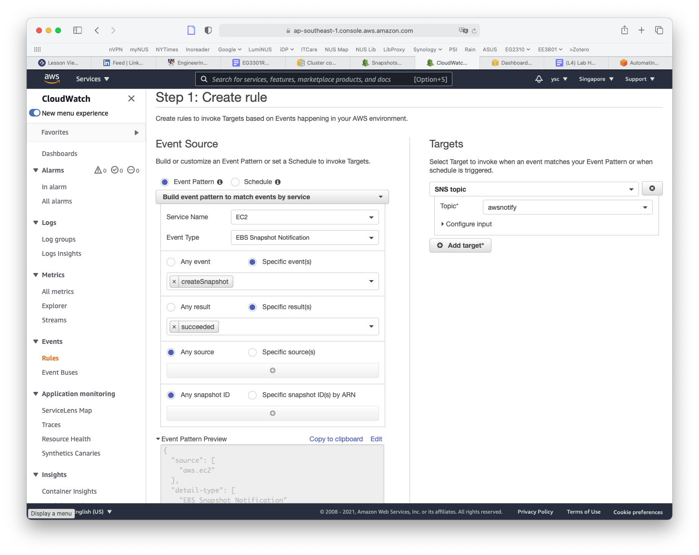

You will now also receive an email when a snapshot is completed.

## 15.
The final thing you will have to do before you create your cluster is to make a copy of the snapshot containing the data that you will be working with for the remaining labs. You can find the snapshot by typing `EC2` into the search bar and select `EC2` in the drop-down list:
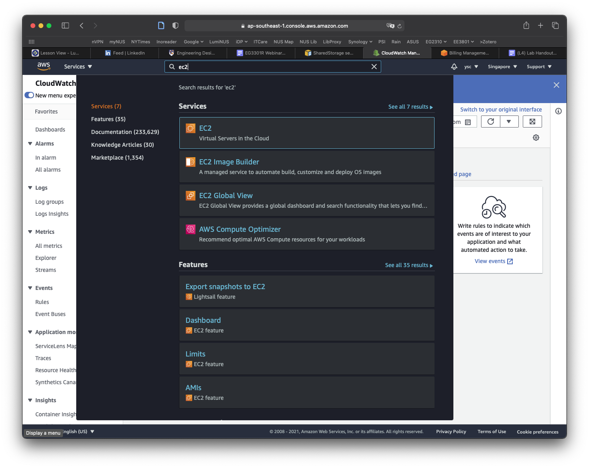

Click `Snapshots` in the left panel:
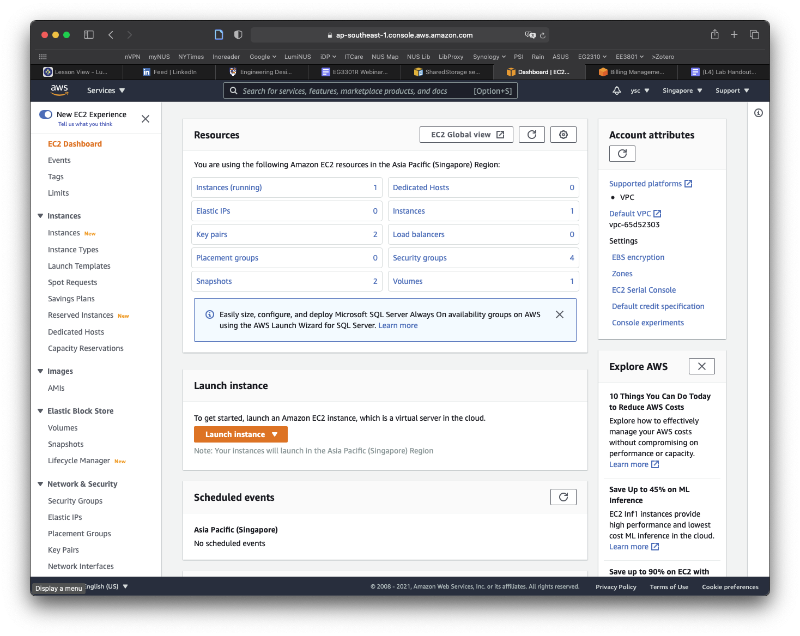

Click on the `Owned By Me` button to reveal the drop-down menu and select `Public Snapshots`. Copy and paste the following snapshot id: `snap-05c0a250a5fa4d56d`, and then hit `Return`. You should see a snapshot with the description `ee3801-2021-data` listed and selected. 
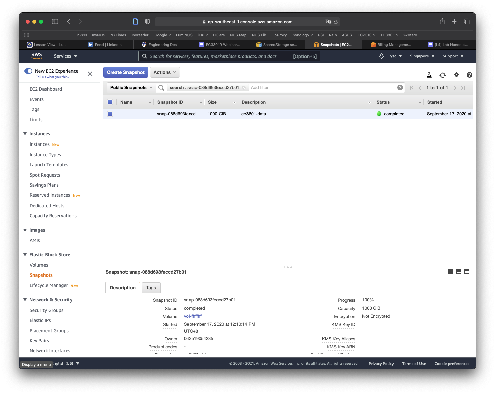

Click on the `Actions` button, and select the Copy command. In the window that appears, replace the description with `data`, make sure the `Encrypt this snapshot` option is **NOT** selected, and then click the `Copy` button. You should see a message that the snapshot is being copied.

Click on the `Public Snapshots` button to select the `Owned By Me` option, and then click on the `x` icon in the search field to remove the snapshot id. You should now see a snapshot with a size of 1000 GiB with the description `data`. If the snapshot is not selected, select it, and you should see more information for the snapshot shown in the panel at the bottom of the window. Move your cursor over the text `Snapshot ID`, which will cause a `Copy to clipboard` icon to appear. Click on it to copy the `Snapshot ID`.
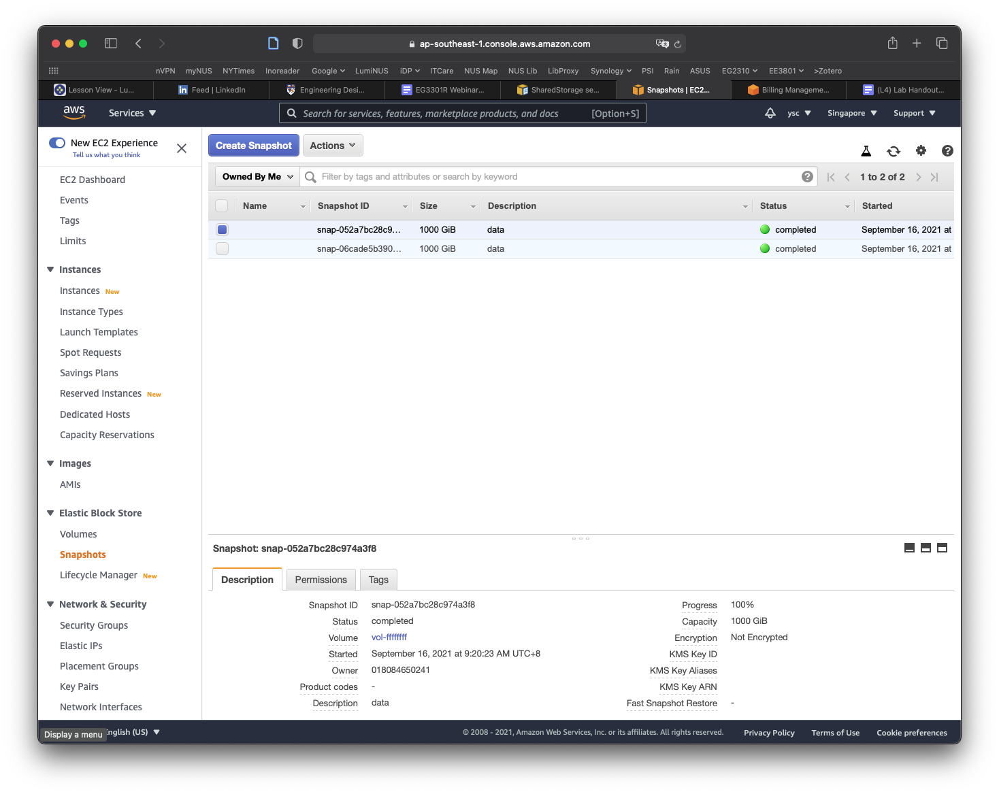

Use nano to edit the `cluster-config.yaml` file and paste the Snapshot ID into the `SnapshotId` field (be sure to add a space after `SnapshotId:`):
```yml
SharedStorage:
  - MountDir: data
    Name: ee3801
    StorageType: Ebs
    EbsSettings:
      Size: 1000
      Encrypted: false
      SnapshotId: snap-xxxxxxxxxxxxxxxxx
```

> <p class="task"> Task
>
> Take a screenshot of your Nano window showing the `SnapshotID` above and include it in your lab report.

Save the file and exit nano.
