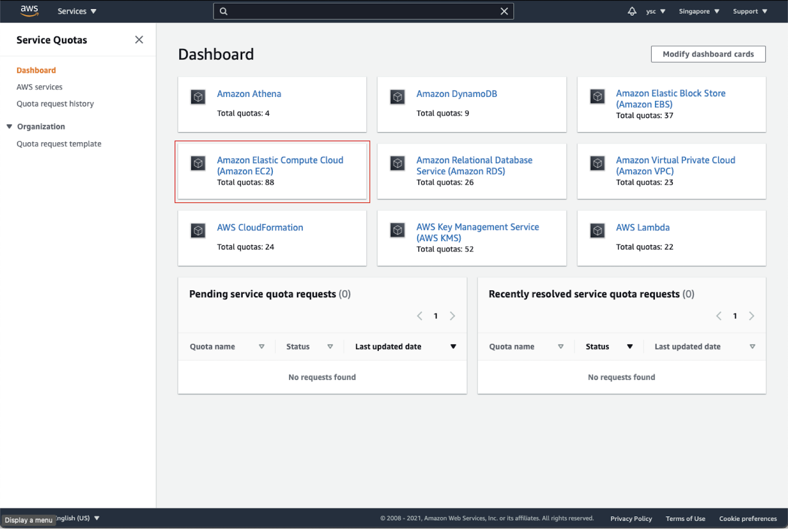
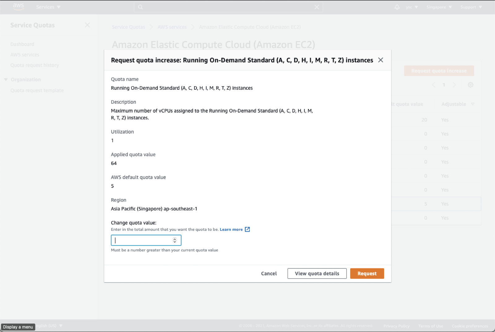
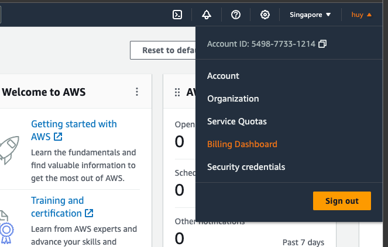
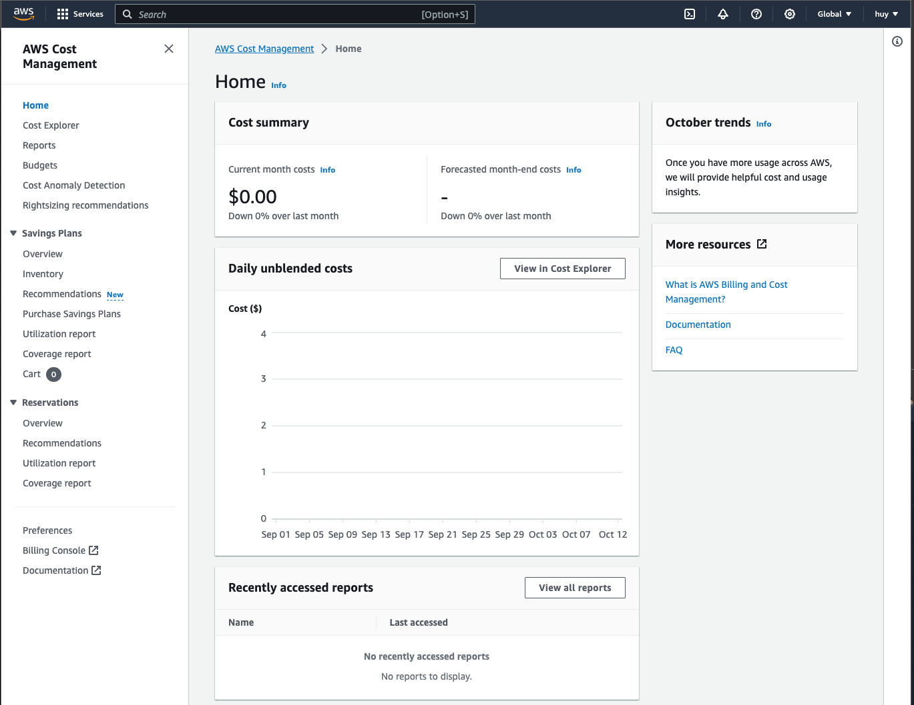

# Part 4. Track your AWS usage

## 18.
In order to track your AWS usage, go to the following [link](https://console.aws.amazon.com).

## 19.
First, click the “Services” drop-down menu in the top left, and then click “EC2”: 


This will take you to your EC2 Dashboard:


Check “Instances (running)”, and make sure that you do not have any instances running. If you do, you might have forgotten to delete a cluster, so you should run the following command from the Terminal:

```shell
(aws) 
$ pcluster list-clusters --region ap-southeast-1
```

Followed by (replace MyCluster01 below with the name of any clusters you see listed above):

```shell
(aws) 
$ pcluster delete-cluster --region ap-southeast-1 --cluster-name MyCluster01
```

> <p class="task"> Task
>
> Once you have made sure that you do not have any running instances, take a screenshot of your EC2 dashboard, and include it in your lab report. 
> 

> <p class="warn"> Warning
> 
> Please remember to do this for all subsequent labs. This is to ensure that you do not have any running instance that could potentially cost you a lot of money.


## 20.
While you are at your EC2 Dashboard, check your virtual cpu limits by typing “Service quotas” in the top search bar and click on the “Service Quotas” service that appears:


Click on “Amazon Elastic Compute Cloud (Amazon EC2)” in the dashboard:



Type “instances” in the search bar, and check your Applied quota value for “Running On-Demand Standard (A, C, D, H, I, M, R, T, Z) instances”. If your limit is not “64”, select that option, and click the “Request quota increase” button in orange in the top right:


Enter “64” in the “Change quota value” text box, and then click the “Request” button in the bottom right:



## 21.
Next, find the link to “My Billing Dashboard”:



Click the “Bill Details” button in the top right:


In the drop-down menu for “Date”, select the current month (you might need to check September’s bill as well since AWS is using US time). Click on “Elastic Compute Cloud”, followed by “No Region” and “Asia Pacific (Singapore)”:


This will list the charges you have incurred, as well as the amount subtracted from your credit balance.

> <p class="task"> Task
>
> Take a screenshot of your Elastic Compute Cloud charges and include it in your lab report. It is fine if there are no charges listed yet.

> <p class="warn"> Warning
> 
> Please remember to do this for all subsequent labs. This is to ensure that your bill is within expectation.

## 22.
In order to track the balance of your AWS credits, click on the “Credits” link in the left sidebar. You should see the following:


> <p class="task"> Task
>
> Take a screenshot of your AWS Credits and include it in your lab report.
 
> <p class="warn"> Warning
> 
> Please remember to do this for all subsequent labs. This is to ensure that your bill is within expectation.

## 23.
In order to avoid being surprised by unexpected charges, you can use AWS Budgets to warn you when your credits are running low. However, you will have to first enable the Cost Explorer feature, which will take 24 hours to be activated. So in this lab, we will just enable the Cost Explorer feature, and return in the next lab to set up the budget. You can enable the Cost Explorer feature by clicking on the “Budgets” link in the left panel, which should show you the following:



Click on the “Create a budget” button, which should take you the page:


Click on the “Enable Cost Explorer” button, which should show you the following:


Click on the “Launch Cost Explorer” button, which should show you a warning that it will take 24 hours for Cost Explorer to be active. You can dismiss the window, and we will return to set up the budget in the next lab assignment.