# Part 5. Track your AWS usage

## 33.
In order to track your AWS usage, go to the following [link](https://console.aws.amazon.com).

## 34.
First, click the “Services” drop-down menu in the top left, and then click “EC2”: 

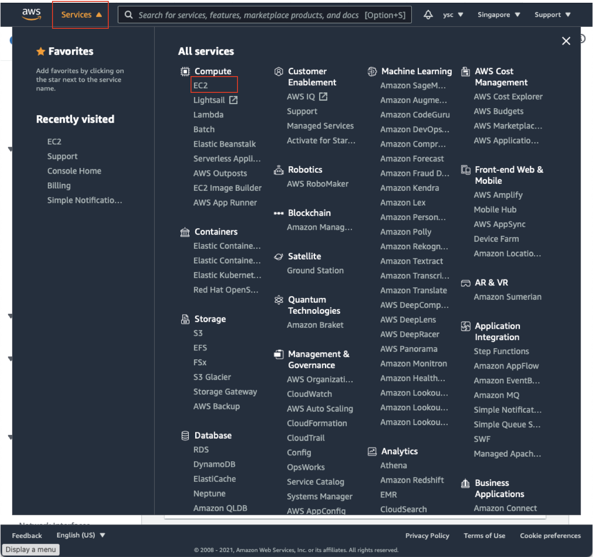

This will take you to your EC2 Dashboard:

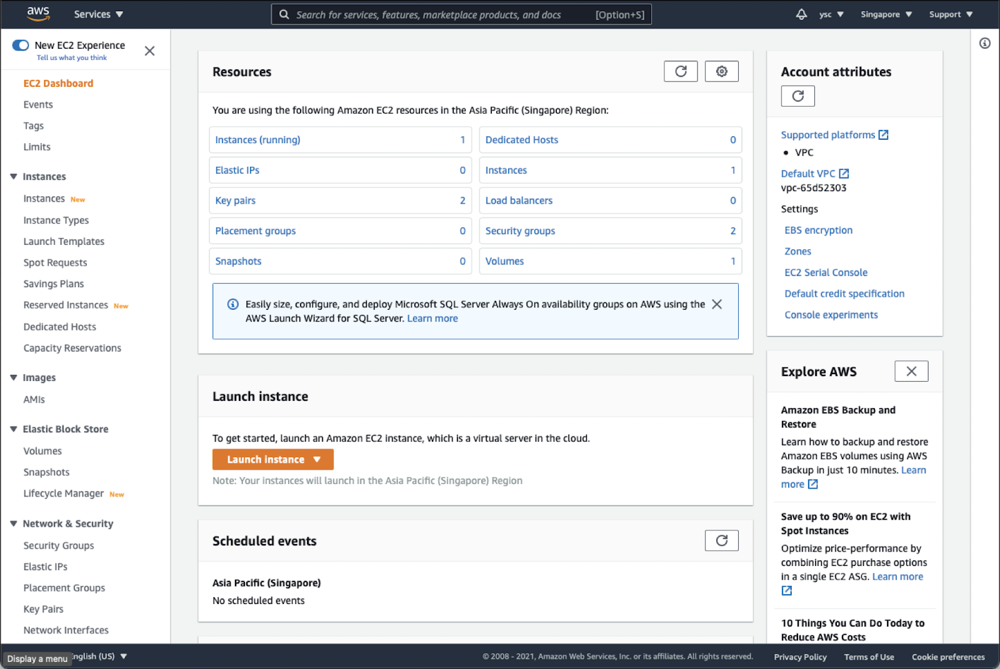

Check “Instances (running)”, and make sure that you do not have any instances running. If you do, you might have forgotten to delete a cluster, so you should run the following command from the Terminal:

```shell
(aws) $ pcluster list-clusters
```

Followed by (replace MyCluster01 below with the name of any clusters you see listed above):

```shell
(aws) $ pcluster delete-cluster -n MyCluster01
```

> <p class="task"> Task
>
> Once you have made sure that you do not have any running instances, take a screenshot of your EC2 dashboard, and include it in your lab report. 
> 

> <p class="warn"> Warning
> 
> Please remember to do this for all subsequent labs. This is to ensure that you do not have any running instance that could potentially cost you a lot of money.


## 35.
While you are at your EC2 Dashboard, check your virtual cpu limits by typing “Service quotas” in the top search bar and click on the “Service Quotas” service that appears:

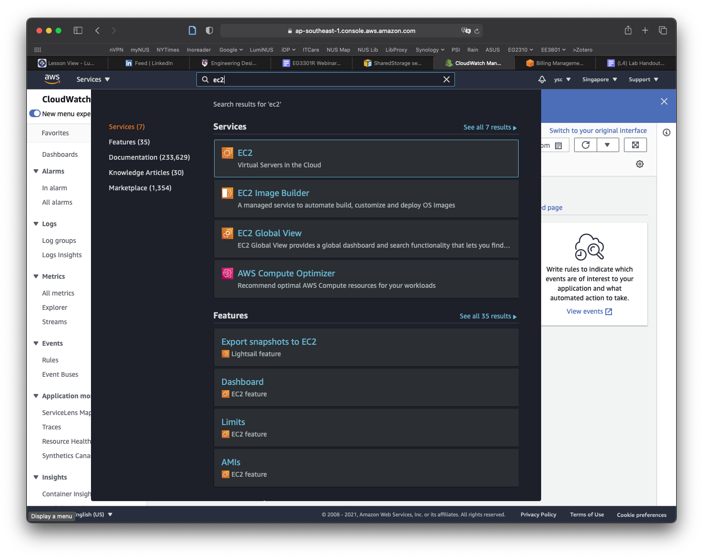

Click on “Amazon Elastic Compute Cloud (Amazon EC2)” in the dashboard:

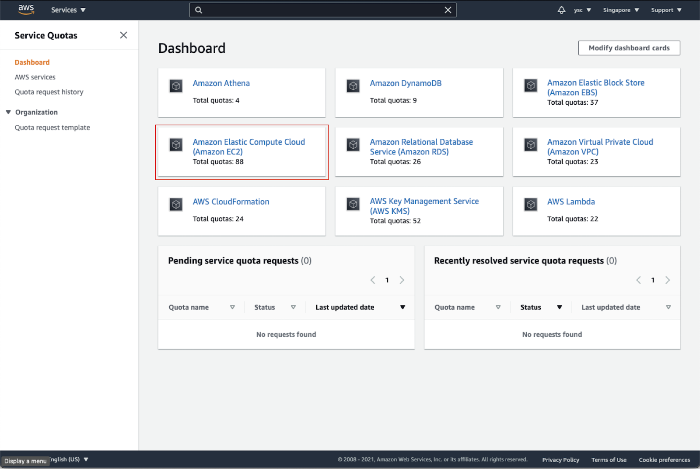

Type “instances” in the search bar, and check your Applied quota value for `Running On-Demand Standard (A, C, D, H, I, M, R, T, Z) instances`. If your limit is not `64`, select that option, and click the `Request quota increase` button in orange in the top right:

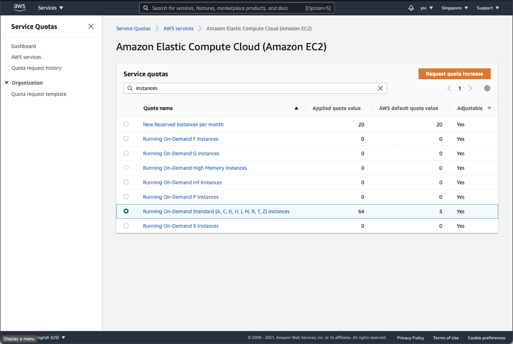

Enter `64` in the `Change quota value` text box, and then click the `Request` button in the bottom right:

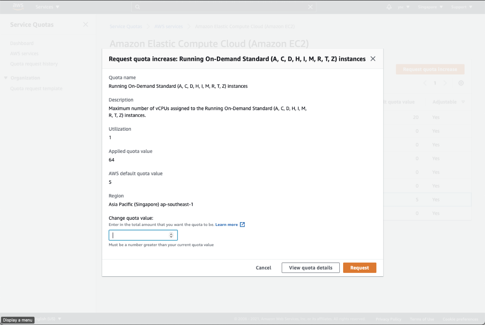

## 36.
Next, find the link to “My Billing Dashboard”:

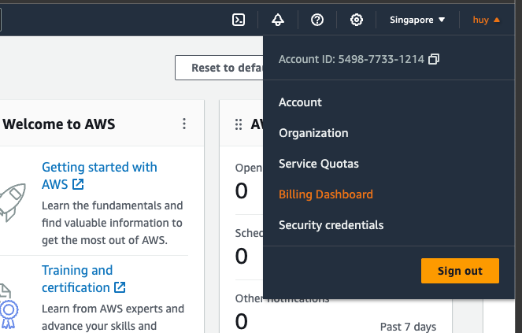

Click the `Bills` option from `Billing` drop down:

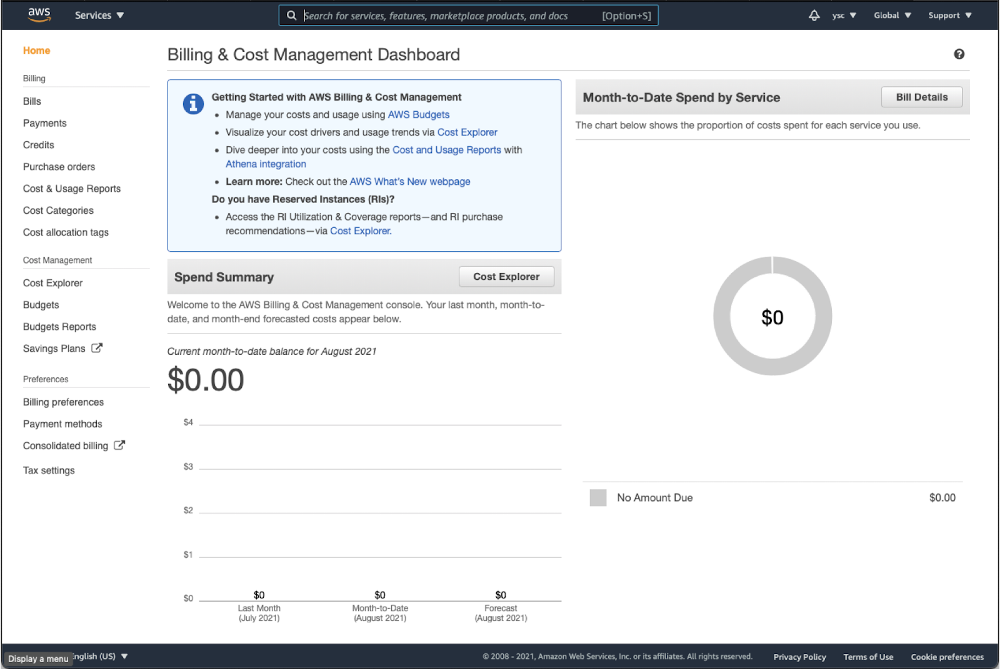

In the drop-down menu for “Billing Period”, select the current month:

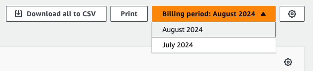

This will list the charges you have incurred.

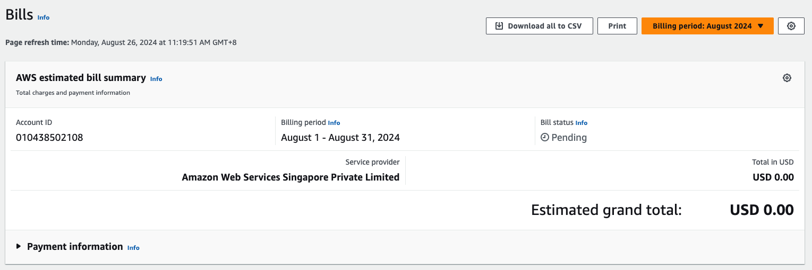

> <p class="task"> Task
>
> Take a screenshot of the screen above to show the charges and include it in your lab report. It is fine if there are no charges listed yet.

> <p class="warn"> Warning
> 
> Please remember to do this for all subsequent labs. This is to ensure that your bill is within expectation.

## 37.
In order to avoid being surprised by unexpected charges, you can use AWS Budgets to warn you when your credits are running low. First navigate to the `Cost Explorer` options under `Cost Management`

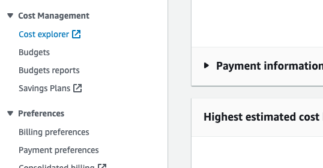

It will open up a new tab and you should see the following:

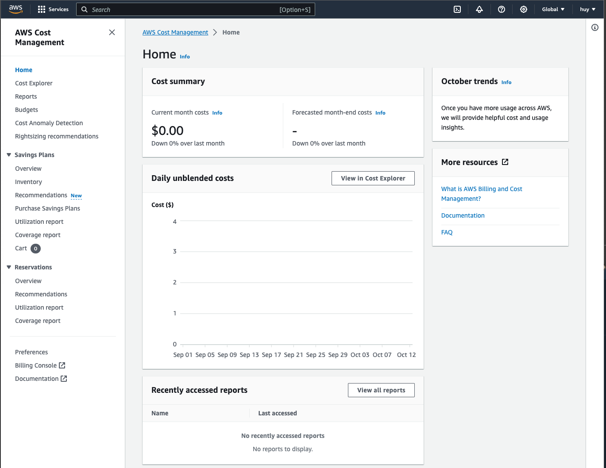

You should be able to see your current month costs. This will usually from our experience by updated more frequently than your billing view, so we also need to check this after every lab.

> <p class="task"> Task
>
> Take a screenshot of the screen above to show the charges and include it in your lab report. It is fine if there are no charges listed yet.

> <p class="warn"> Warning
> 
> Please remember to do this for all subsequent labs. This is to ensure that your bill is within expectation.


## 38.
Remember to always check for your budgets from this lab onward, as it will tell you if you have accidentally incur an exhorbitant cost to your services that could cause you an arm and a leg. In the next section, we will set up a budget which will allow us to receive email or notification before we exceed our cost, which will help us manage our budget better.