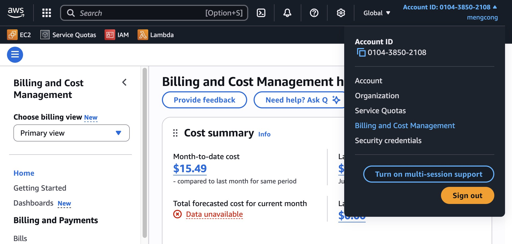

# Part 11. Wrapping up

## 72.
Once you are done, you can exit your cluster, and then update your snapshot:

```shell
update_snapshot.sh data 2 MyCluster01
```

## 73.
Once you receive the email notification, you can delete the cluster:

```shell
pcluster delete-cluster -n MyCluster01
```

## 74. 
In the next lab, we will look at ways to parallelize the data processing.

## 75.
Go to your `Billing and Cost Management Dashboard`:



Click on `Budgets` in the left panel:


Scroll to make sure the "Amount used" column is visible.

> <p class="task"> Task
>
> Include a screenshot of your budget page in your lab report.