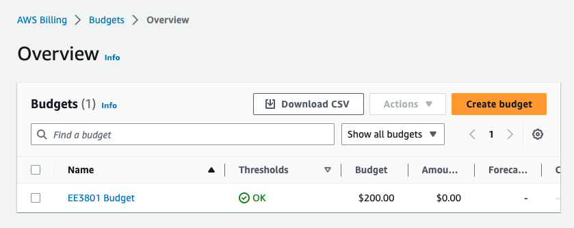

# Part 10. Wrapping up

## 76.
Once you are done, you can exit your cluster, and then update your snapshot:

```shell
(aws) $ update_snapshot.sh data 2 MyCluster01
```

## 77.
Once you receive the email notification, you can delete the cluster:

```shell
(aws) $ pcluster delete-cluster -n MyCluster01
```

## 78. 
In the next lab, we will look at ways to parallelize the data processing.

## 79.
In the Part A, we started the process of setting up an AWS Budget to warn you when your credits are running low. You can now resume by going to your Billing Dashboard:


Click on “Budgets” in the left panel:


Click on the “Create budget” button:


Choose “Customize (advanced)” under “Budget setup”, select the “Cost budget - Recommended” option, and scroll down to click the “Next” button:


Scroll down to the “Set budget amount” section, select “Quarterly” under “Period”, ”Expiring budget” under “Budget effective date”, “Q4” and “2021” under “Start quarter”, “Q4” and “2021” under “End quarter”, “Fixed” under “Choose how to budget”, and enter “400.00” in “Enter your budgeted amount ($)”:



Scroll down to “Budget name” and enter “EE3801”, and then click the “Next” button:


Click on the “Add an alert threshold” button:


Enter “80” under “Threshold”, fill in your email address under “Email recipients”, click the “Next” button at the bottom of the page:


Click on the “Next” button to skip the “Attach actions” section:


Review your entries, and click the “Create budget” at the bottom of the page:


This will take you back to the budgets page to show you the budget you created:


You will now get an email warning when your charges exceed 80% of your credits. 

> <p class="task"> Task
>
> Include a screenshot of your budget page in your lab report.